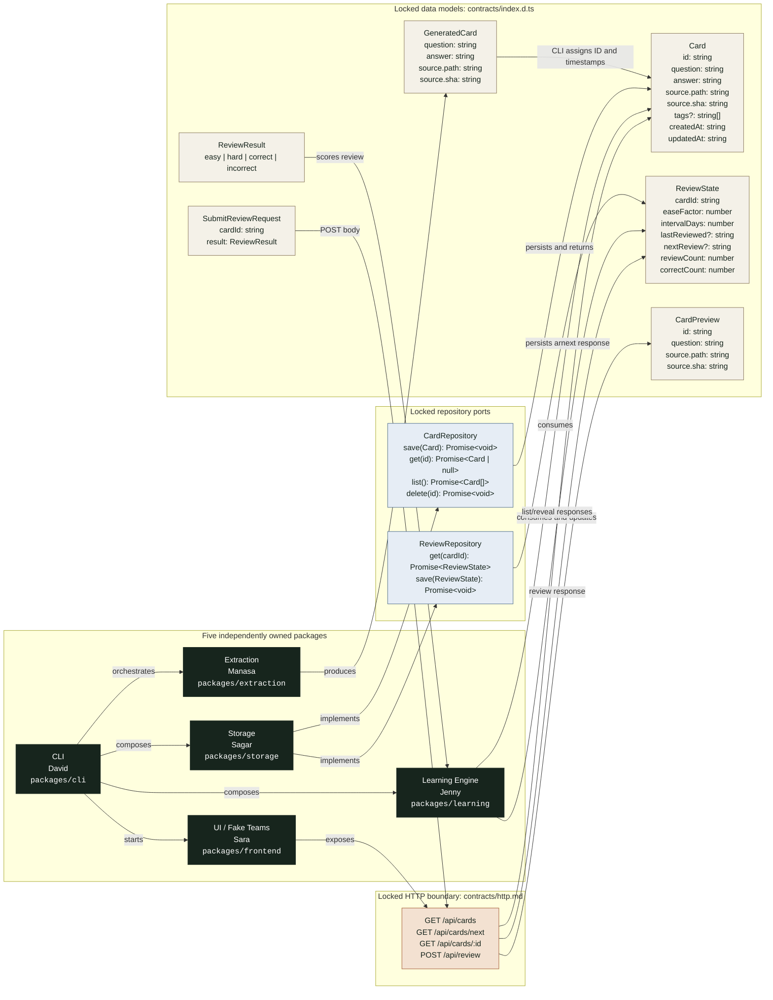

# FlashLearn

FlashLearn turns a Git repository into source-attributed study cards and serves them through a local spaced-repetition experience. It is organized as five independently owned npm workspace packages connected by stable contracts, allowing each workstream to develop and test in parallel.

## Feature Map

`Done` means a tested baseline is implemented on `main`; it does not imply the feature is production-complete. `In Progress` identifies the next product-level capability beyond that baseline.

| Feature | Status | Current capability | Next milestone | Owner |
| --- | --- | --- | --- | --- |
| Shared contracts | **Done** | Card, generated-card, review-state, repository, and HTTP contracts are defined. | Evolve only through coordinated contract review. | David / all owners |
| Package isolation | **Done** | Five workspaces, import-boundary checks, one-package CI enforcement, and CODEOWNERS are in place. | Configure required checks and real GitHub teams in repository settings. | David |
| CLI orchestration | **Done** | `init`, `generate`, and `start` support directory arguments; start supports host and port options. | Package and distribute a directly installable `flashlearn` executable. | David |
| CLI integration harness | **Done** | In-memory repositories, recording fakes, package contract tests, and a full pipeline test are available. | Expand tests as package implementations replace their starter surfaces. | David |
| Local JSON storage | **Done** | Cards and review state persist under `.flashlearn/` with idempotent initialization and atomic writes. | Add schema validation, migration handling, and broader failure coverage. | Sagar |
| Repository scanning | **Done** | JavaScript, TypeScript, JSX, TSX, and Markdown files are scanned with path and Git SHA attribution. | Add configurable include/exclude rules and richer repository handling. | Manasa |
| Question generation | **In Progress** | Adjacent `Q:` and `A:` annotations produce attributed cards. | Implement AI-backed knowledge, question, and answer generation. | Manasa |
| Review scheduling | **Done** | Baseline easy, hard, correct, and incorrect scheduling updates review state and due dates. | Validate and tune the spaced-repetition algorithm with broader tests. | Jenny |
| HTTP API | **Done** | Card list, next card, answer reveal, and review submission endpoints are implemented. | Harden validation and error behavior as integrations mature. | Sara |
| Learning UI | **In Progress** | A local page displays the next question, source attribution, and revealed answer. | Build the fake Teams experience and add review-result controls. | Sara |
| Local quality gates | **Done** | CI validates scope, types, tests, and builds; Husky provides pre-commit and pre-push feedback. | Keep checks fast and aligned with the documented workflow. | David |

## Workstreams

| Workstream | Owner | Package | Responsibilities | May depend on |
| --- | --- | --- | --- | --- |
| **CLI / Project Management Layer** | David | `packages/cli` | `flashlearn init [directory]`, `flashlearn generate [directory]`, `flashlearn start [directory]`, directory selection, orchestration, local web server startup, contracts, and integration between components. | All packages |
| **Question Extraction / AI Generation** | Manasa | `packages/extraction` | Repository ingestion and scanning, knowledge extraction, question generation, answer generation, and source attribution (`path`, `sha`). | Contracts only |
| **Storage / Repository Layer** | Sagar | `packages/storage` | Card persistence, retrieval APIs, local JSON storage format, and repository abstractions. | Contracts only |
| **Learning Engine / Spaced Repetition** | Jenny | `packages/learning` | Review scheduling, spaced repetition logic, card selection, and easy/hard/correct/incorrect scoring. | Contracts only |
| **UI / Fake Teams Experience** | Sara | `packages/frontend` | Card display, answer reveal, review actions, HTTP handlers, and the fake Teams browser experience. | Contracts only |

David's directory responsibility is selecting the input directory and passing it into the pipeline. Manasa owns traversing and interpreting that repository inside the extraction package. David starts the local server through orchestration; Sara owns the server's HTTP handlers and UI behavior inside the frontend package.

Each contributor should change only their assigned `packages/<name>/` directory. Package tests and implementation stay together. Changes to `contracts/`, root configuration, or integration wiring require review from all affected owners.

## Workstream Interfaces

The end-to-end handoff is:

```text
David (CLI / orchestration)
  -> Manasa (question generation)
  -> Sagar (card storage)
  -> Jenny (learning engine)
  -> Sara (UI / fake Teams experience)
```

The flow describes data handoffs, not implementation imports. Only `packages/cli` composes concrete package implementations. Every other package works against types and interfaces in `contracts/`, allowing each owner to develop and test independently with mocks.

David is responsible for defining and coordinating agreement on these contracts before implementation changes cross package boundaries:

1. `Card` and `GeneratedCard`
2. `ReviewState` and review result values
3. `CardRepository` and `ReviewRepository`
4. CLI commands: `flashlearn init [directory]`, `flashlearn generate [directory]`, and `flashlearn start [directory] [--host <host>] [--port <port>]`
5. API endpoint names and HTTP payloads

The locked HTTP endpoints are:

```http
GET /api/cards
GET /api/cards/next
GET /api/cards/:id
POST /api/review
```

Once the team agrees on these contracts, contributors should build against package-local mocks and tests. The implementations can then merge through the CLI composition layer with minimal coordination overhead.

### Contract Map

The arrows show which package produces, consumes, implements, or exposes each locked contract. The CLI is the only package that connects concrete implementations; the other packages depend on the shared contract rather than one another.



## Locked Contract

`contracts/index.d.ts` locks `Card`, `GeneratedCard`, `ReviewState`, repository ports, and review results. `contracts/http.md` locks endpoint names and payloads. Storage is JSON with these files:

```text
.flashlearn/
  cards.json
  review.json
  settings.json
```

`npm run boundaries` rejects imports between implementation packages. Only the CLI can import package implementations. `CI / Only Edit One Package` rejects a pull request that edits more than one directory under `packages/`; shared root and contract changes do not count as an additional package. `CI / Validate` runs boundaries, typechecks, and tests. `CI / Build` builds the complete workspace and smoke-tests the compiled CLI. Configure the five placeholder teams in `.github/CODEOWNERS`, then enable required code-owner reviews and these CI checks in GitHub branch protection.

## Development

```bash
npm install
npm run check
npm run build
npm run test --workspace @flashlearn/learning
```

Run the development CLI from the repository root:

```bash
npm run dev --workspace @flashlearn/cli -- --help
npm run dev --workspace @flashlearn/cli -- init .
npm run dev --workspace @flashlearn/cli -- generate .
npm run dev --workspace @flashlearn/cli -- start . --host 127.0.0.1 --port 4173
```

The CLI returns exit code `0` for success, `1` for execution failures, and `2` for invalid commands or arguments. See `packages/cli/README.md` for its dependency-injection and integration-test structure.

Husky installs through the root `prepare` script. Pre-commit checks package boundaries and staged whitespace. Pre-push enforces one-package scope, runs all checks, and builds the complete workspace. CI remains authoritative because hooks can be bypassed with `--no-verify`.

The baseline extractor creates cards from adjacent annotations in supported source and Markdown files:

```ts
// Q: What starts the local application?
// A: The flashlearn start command.
```

The `QuestionExtractor` port is the seam for replacing this baseline with an LLM-backed implementation without changing storage or learning code.
