<p align="center">
  
</p>

<h1 align="center">FlashLearn</h1>

<p align="center">
  <a href="https://www.npmjs.com/package/@flashlearnai/cli"></a>
  <a href="https://github.com/flashlearn-ai/flashlearn/actions/workflows/ci.yml?query=branch%3Amain"></a>
  <a href="https://github.com/flashlearn-ai/flashlearn/actions/workflows/pages.yml?query=branch%3Amain"></a>
</p>

<p align="center"><a href="https://flashlearn-ai.github.io/flashlearn/">Website</a> · <a href="https://flashlearn-ai.github.io/flashlearn/demo/">Try the static demo</a></p>

<p align="center"><strong>Agentic AI for compounding learning velocity.</strong></p>

<p align="center">Onboard effectively to unfamiliar code repositories by turning their source into attributed study cards and a local spaced-repetition experience.</p>

<p align="center"><strong>Local-first:</strong> cards and review state are stored in your project's <code>.flashlearn/</code> directory. Offline extraction stays local; configured AI endpoints receive source code and have their own access controls and retention policies.</p>

## Getting started

Requires Node.js 22.14+ and Git for commit attribution.

```bash
npm install --global @flashlearnai/cli
flashlearn generate --project /path/to/your/repo
flashlearn start --project /path/to/your/repo
```

Open **http://localhost:4173** to study. Generation initializes storage automatically. Run `flashlearn --help` for options, or [try the web demo](https://flashlearn-ai.github.io/flashlearn/demo/).

## Feature Map

This map tracks completion of the agreed owner workstreams, not whether prototype code exists. ✅ means the responsible owner has completed and merged the agreed package implementation. 🚧 means the workstream is still in progress. Package colors match the contract map: 🔵 CLI, 🟢 extraction, 🟠 storage, 🟣 learning, and 🔴 frontend. Starter code, mocks, and baseline implementations do not make a package complete.

1. 🔵 **CLI / orchestration** (`packages/cli`)
   - **Status:** ✅ Done
   - **Owner:** David
   - **Features:** `init`, `generate`, `start`, `project show/status`, `question list/get`, per-invocation `--project`, structured output, scoped extraction, local server startup, orchestration, and integration tests
   - **Dependencies:** May depend on all packages
   - **Current:** Cwd-based project selection, text/JSON/YAML queries, auto-initializing generation with progress and a 100-card/run cap, bounded Copilot `auto` batching with model override, empty-deck startup confirmation, and extraction scope
   - **Next:** PR #59 adds inference-source selection, improved offline recall, and `review` terminal sessions with persisted ratings; integrate after review

2. 🟢 **Extraction / AI generation** (`packages/extraction`)
   - **Status:** ✅ Done
   - **Owner:** Manasa
   - **Features:** Repository scanning, Markdown headings, JSDoc, Go doc comments, undocumented export signatures, answer cleanup, and source attribution (`path`, `sha`)
   - **Dependencies:** Shared contracts only
   - **Current:** Deterministic extraction and optional endpoint-backed generation support Go, JavaScript, JSX, Markdown, TypeScript, and TSX, with generated-source skipping, scoped scans, and card-quality filtering
   - **Next:** Decide what `sha` should hold when the input is not a Git repository (the only Known Gap)

3. 🟠 **Storage / repositories** (`packages/storage`)
   - **Status:** ✅ Done
   - **Owner:** Sagar
   - **Features:** Card persistence, review-state persistence, schema validation, atomic JSON writes, path helpers, and repository abstractions
   - **Dependencies:** Shared contracts only
   - **Current:** Production `StorageService`, card repositories, and review repositories implement the locked interfaces under `.flashlearn/`
   - **Next:** Add migrations when persisted schemas evolve, broaden malformed-data and isolation tests

4. 🟣 **Learning engine** (`packages/learning`)
   - **Status:** ✅ Done
   - **Owner:** Jenny
   - **Features:** Review scheduling, spaced-repetition logic, due-card selection, and easy/hard/correct/incorrect scoring
   - **Dependencies:** Shared contracts only
   - **Current:** Deterministic review scheduling, scoring, and overdue-first due-card selection are implemented and tested
   - **Next:** The review controls are connected: the client submits grades and renders the `nextReview` this package returns, rather than computing an interval of its own

5. 🔴 **Frontend / fake Teams** (`packages/frontend`)
   - **Status:** ✅ Done
   - **Owner:** Sara
   - **Features:** Card display, answer reveal, review actions, HTTP handlers, and the fake Teams browser experience
   - **Dependencies:** Shared contracts only
   - **Current:** The Node server serves the locked endpoints and built Teams client. Live study reveals and rates server-selected due cards, capped at 12 acknowledged reviews with persisted schedules; both live routes deal every card as multiple choice or recall, mixed by default; the sample demo differs only in that its ratings are session-only. Source excerpts are available in the sample deck only
   - **Next:** Nothing outstanding. Deliberate omissions are listed below and need their owners' agreement before any surface claims them

Shared infrastructure is ✅ **Done**: the data and HTTP contracts, workspace ownership rules, package-scope enforcement, CI, and local hooks are in place.

### Supported Inputs

One project root per running server, verified against each of these:

| Input | Works | Attribution |
| --- | --- | --- |
| A Git repository | Yes | Repository-relative `path` and the commit `sha` |
| A subdirectory of a repository | Yes, via `generate --subpath <dir>` | Paths stay repository-relative, so the commit still resolves |
| A plain folder of documents | Yes | `path` only; `sha` is `"unknown"` and the client shows no commit |
| Several files in that folder | Yes — every supported file is scanned | Each card cites the file it came from |
| Several projects at once | **No** | Each project keeps its own `.flashlearn/`; run a second `flashlearn start` |

Supported sources are `.go`, `.js`, `.jsx`, `.md`, `.ts`, and `.tsx`. Generated, dependency, Git, and `.flashlearn/` directories are skipped, along with machine-generated files, Go test files, and changelogs. A large repository needs scoping before it produces a deck worth studying: `generate --subpath` and `--max-files` narrow the run without moving the project root.

### Known Gaps

A gap is something the project states and does not do. Two qualify.

1. **A non-Git folder yields `sha: "unknown"`.** Extraction still produces usable cards, and the client omits the commit rather than printing a placeholder, but `AGENTS.md` states every card source must carry a Git `sha`. Either extraction hashes file contents when there is no repository, or the contract admits `sha` is optional. That choice belongs to extraction and every contract owner.
2. **Validation does not catch answers that waste review time by length or by carrying comment syntax.** `AGENTS.md` states `validateCards()` filters cards that would waste review time, and it does remove answers that are too short, restate the question, or lean on omitted context. Nothing removes an answer too long to read as an option, or one containing comment delimiters. Measured across two generated decks: FlashLearn's own 117 cards have a median answer of 387 characters, 54% over 300, and 23 answers carrying comment syntax such as `*/ function usable`; 312 cards generated from Kubernetes' `pkg/scheduler` have a median of 94, 7% over 300, and none. A file-level doc comment sitting immediately above the first declaration is also attributed to that declaration, so `contracts/index.d.ts` yields "What does `Card` do?" answered by the module's description rather than the type's. Both belong to extraction.

### Deliberate Omissions

These are absences with a reason, not work owed. Nothing in the product or its documentation offers them.

- **A live card carries no excerpt.** `Card.source` holds `path` and `sha`; only the bundled sample deck ships excerpts, so only a sample card can expand a source panel. Carrying excerpts in generated cards would change `GeneratedCard` and copy source text into `cards.json`, where it would go stale against the file it quotes.
- **One project is studied at a time.** `flashlearn start` serves a single project root: `GET /api/project` returns one `ProjectIdentity`, and review state lives in that project's own `.flashlearn/`. A repository, a folder, or a handful of loose documents all work as that root, and a non-Git folder simply cites no commit. Studying a second project means a second `start` pointed elsewhere. Merging decks would collide topic names, because topics come from directory names and `util`, `testing` and `api` recur across repositories; it would also strip the repository from repository-relative source paths, making attribution unreadable, and require merging schedules that are stored separately by design.
- **Card-quality feedback is not collected.** A control that discards its input while thanking the user is worse than its absence, so none is built. Collecting it needs somewhere to put it.
- **Mastery is not reported.** The client shows deck counts and, from this browser’s own review history, per-topic recall rates. `ReviewState` holds `reviewCount` and `correctCount` per card, but nothing exposes them in aggregate, and what "mastered" means is the learning package's call to make before any surface claims it.

## Workstream Interfaces

The end-to-end handoff is:

```text
David (CLI / orchestration)
  -> Manasa (question generation)
  -> Sagar (card storage)
  -> Jenny (learning engine)
  -> Sara (UI / fake Teams experience)
```

The flow describes data handoffs, not implementation imports. Only `packages/cli` composes concrete package implementations. Every other package works against types and interfaces in `contracts/`, allowing each owner to develop and test independently with mocks.

David is responsible for defining and coordinating agreement on these contracts before implementation changes cross package boundaries:

1. `Card` and `GeneratedCard`
2. `ReviewState` and review result values
3. `CardRepository` and `ReviewRepository`
4. CLI commands and per-invocation project selection (see the [CLI README](packages/cli/README.md))
5. API endpoint names and HTTP payloads

The locked HTTP endpoints are:

```http
GET /api/cards
GET /api/cards/next
GET /api/cards/:id
GET /api/project
POST /api/review
```

Once the team agrees on these contracts, contributors should build against package-local mocks and tests. The implementations can then merge through the CLI composition layer with minimal coordination overhead.

### Contract Map

Types are physically declared in `contracts/index.d.ts` when they cross package boundaries, but every type has one owning workstream. Its package area below owns the type's meaning and evolution; consumers use the shared declaration without taking ownership. Only the CLI connects concrete package implementations.

Map legend: ⚙️ method, 🧩 type, 🌐 HTTP endpoint, 📁 local storage.

```mermaid
flowchart TD
  subgraph CLIRegion["🔵 CLI / orchestration · David · packages/cli"]
    CLI["<b>⚙️ Methods:</b><br/>projectRoot(input)<br/>flashlearnRoot(input)<br/>project show · status<br/>question get · list<br/>initialize(root)<br/>generate(root, options?)<br/>start(root, options?)<br/><br/><b>🧩 Type:</b> ProjectStatus<br/>project · cards · reviewed<br/>unreviewed · due<br/><br/><b>🧩 Type:</b> StartOptions<br/>host? · port?<br/><br/><b>🧩 Type:</b> Card<br/>id · question · answer<br/>source.path · source.sha · tags?<br/>createdAt · updatedAt"]
  end

  subgraph PackagePipeline["Contract handoffs"]
    direction LR
    subgraph ExtractionRegion["🟢 Extraction / AI generation · Manasa · packages/extraction"]
      Extraction["<b>⚙️ Methods:</b><br/>scanRepository(root)<br/>generateFromDocument(document)<br/>generateFromRepository(root)<br/><br/><b>🧩 Type:</b> SourceDocument<br/>path · content · sha<br/><br/><b>🧩 Type:</b> GeneratedCard<br/>question · answer<br/>source.path · source.sha"]
    end

    subgraph StorageRegion["🟠 Storage / repositories · Sagar · packages/storage"]
      Storage["<b>⚙️ Methods:</b><br/>initialize(projectRoot)<br/>createCardRepository(projectRoot)<br/>createReviewRepository(projectRoot)<br/><br/><b>📁 .flashlearn/</b><br/>cards.json · generated cards<br/>review.json · learning state<br/>settings.json · local configuration<br/><br/><b>🧩 Type:</b> CardRepository<br/>save · get · list · delete<br/><br/><b>🧩 Type:</b> ReviewRepository<br/>get · save"]
    end

    subgraph LearningRegion["🟣 Learning engine · Jenny · packages/learning"]
      Learning["<b>⚙️ Methods:</b><br/>createReviewState(cardId)<br/>scheduleReview(state, result, now?)<br/>selectNextCard(cards, states, now?)<br/><br/><b>🧩 Type:</b> ReviewState<br/>cardId · easeFactor · intervalDays<br/>lastReviewed? · nextReview?<br/>reviewCount · correctCount<br/><br/><b>🧩 Type:</b> ReviewResult<br/>easy · hard · correct · incorrect"]
    end

    subgraph FrontendRegion["🔴 Frontend / fake Teams · Sara · packages/frontend"]
      Frontend["<b>⚙️ Methods:</b><br/>createServer(services) · renderPage()<br/>listCards() · nextCard() · getCard(id)<br/>submitReview(cardId, result)<br/><br/><b>🧩 Type:</b> CardPreview<br/>id · question<br/>source.path · source.sha<br/><br/><b>🧩 Type:</b> SubmitReviewRequest<br/>cardId · result<br/><br/><b>🧩 Type:</b> ProjectIdentity<br/>name<br/><br/><b>🌐 HTTP:</b><br/>GET /api/cards<br/>GET /api/cards/next<br/>GET /api/cards/:id<br/>GET /api/project<br/>POST /api/review"]
    end
  end

  Extraction -->|GeneratedCard via CLI| Storage
  Storage -->|Card + ReviewState| Learning
  Learning -->|due Card + review updates| Frontend
  CLI -.->|invokes generation| Extraction
  CLI -.->|provides projectRoot| Storage
  CLI -.->|requests scheduling| Learning
  CLI -.->|starts server| Frontend

  classDef cli fill:#dbeafe,color:#17251d,stroke:#2563eb,stroke-width:2px;
  classDef extraction fill:#dcfce7,color:#17251d,stroke:#16a34a,stroke-width:2px;
  classDef storage fill:#fef3c7,color:#17251d,stroke:#d97706,stroke-width:2px;
  classDef learning fill:#f3e8ff,color:#17251d,stroke:#9333ea,stroke-width:2px;
  classDef frontend fill:#ffe4e6,color:#17251d,stroke:#e11d48,stroke-width:2px;
  class CLI cli;
  class Extraction extraction;
  class Storage storage;
  class Learning learning;
  class Frontend frontend;
  style ExtractionRegion fill:#bbf7d0,stroke:#15803d,stroke-width:4px,color:#14532d
  style CLIRegion fill:#bfdbfe,stroke:#1d4ed8,stroke-width:4px,color:#1e3a8a
  style StorageRegion fill:#fde68a,stroke:#b45309,stroke-width:4px,color:#78350f
  style LearningRegion fill:#e9d5ff,stroke:#7e22ce,stroke-width:4px,color:#581c87
  style FrontendRegion fill:#fecdd3,stroke:#be123c,stroke-width:4px,color:#881337
  style PackagePipeline fill:transparent,stroke:#64748b,stroke-width:2px,stroke-dasharray:5 5
```



Contract ownership is:

1. **CLI:** `Card`, `StartOptions`, `projectRoot()`, `flashlearnRoot()`, and orchestration methods
2. **Extraction:** `SourceDocument`, `GeneratedCard`, and extraction methods
3. **Storage:** `.flashlearn/` contents, `CardRepository`, `ReviewRepository`, and storage lifecycle methods
4. **Learning:** `ReviewState`, `ReviewResult`, and scheduling methods
5. **Frontend:** `CardPreview`, `SubmitReviewRequest`, HTTP endpoints, and frontend service methods

## Locked Contract

`contracts/index.d.ts` locks `Card`, `GeneratedCard`, `ReviewState`, repository ports, and review results. `contracts/http.md` locks endpoint names and payloads. Storage is JSON with these files:

```text
.flashlearn/
  cards.json
  review.json
  settings.json
```

`npm run boundaries` rejects imports between implementation packages. Only the CLI can import package implementations. `CI / Only Edit One Package` rejects a pull request that edits more than one directory under `packages/`; shared root and contract changes do not count as an additional package. `CI / Validate` runs boundaries, typechecks, and tests. `CI / Build` builds the complete workspace and smoke-tests the compiled CLI. Configure the five placeholder teams in `.github/CODEOWNERS`, then enable required code-owner reviews and these CI checks in GitHub branch protection.

## Development

For packaging, publishing, and website deployment, see the [npm and GitHub Pages release runbook](docs/release-readiness.md). `npm run release:check` builds and tests the installable CLI tarball. `npm run site:build` builds the landing page and docs; add `-- --demo` to include the sample demo, which is otherwise not published. `npm run site:preview` serves them locally at `http://127.0.0.1:4182/flashlearn/`. Publishing and deployment require the owner setup described in the runbook.

The public npm package is [`@flashlearnai/cli`](https://www.npmjs.com/package/@flashlearnai/cli) and installs the `flashlearn` executable. Install with `npm install --global @flashlearnai/cli` or run `npx @flashlearnai/cli --help`.

Once npm trusted publishing is configured, publishing a GitHub Release triggers the OIDC npm workflow. Its tag must match `release/package.json` on a commit in `main`; see the runbook for stable/prerelease selection and first-publication setup.

```bash
npm install
npm link
npm run check
npm run build
npm run test:browser:live --workspace @flashlearn/frontend
npm run test --workspace @flashlearn/learning
```

`npm link` at the repository root installs the `flashlearn` executable from the checkout. The linked launcher rebuilds stale workspace output before running and keeps the caller's working directory as the default project.

Run the development CLI from the repository root:

```bash
npm run cli -- --help
npm run cli -- generate --project /path/to/repo
npm run cli -- start --project /path/to/repo --host localhost --port 4173
npm --silent run cli -- project status --project /path/to/repo -o json
```

The root `cli` runner uses the repository root as its working directory. Input/output fingerprints let it reuse valid sibling builds and rebuild changed or missing outputs, including the live frontend bundle. Arguments after `--` are passed to FlashLearn. Use `npm --silent run cli` when consuming JSON/YAML stdout; build logs, project diagnostics, and generation progress go to stderr.

Installed CLI commands default to the caller's working directory. Every command accepts `--project <directory>` (or `-p`) for that invocation, before or after the command. Relative paths resolve against cwd. `init [directory]`, `generate [directory]`, and `start [directory]` retain positional directories as compatibility aliases, mutually exclusive with `--project`.

**Migration:** `FLASHLEARN_PROJECT` and saved user configuration are ignored and left untouched. `project set` returns an argument error (exit code 2) with migration guidance. Use `project show` to inspect this invocation's directory; `init` creates storage only.

The recommended first run is `flashlearn generate` followed by `flashlearn start`. Generation initializes missing storage, so `init` is optional. A dedicated **INFERENCE SOURCE** stage announces configured endpoint variables or offers one menu for Copilot, OpenAI, Claude, custom HTTP(S) endpoint, and offline heuristic. `generate --inference-source <name>` selects a source explicitly. OpenAI/Claude keys and custom endpoint authentication are masked, current-run-only, and never persisted. Noninteractive runs without configured inference clearly use offline extraction. Empty-deck startup asks for confirmation in a terminal (default no); `flashlearn start --yes` (or `-y`) approves generation. Existing decks are not regenerated; failed generation or a still-empty deck prevents startup.

The offline heuristic now favors complete definitions and explanatory prose instead of generic heading dumps. It skips procedures, media, tool/demo docs and dangling fragments, preserves sentence boundaries and qualifies aspirational docs. It remains extractive recall without LLM categories; see the [CLI quality experiment](packages/cli/README.md#offline-heuristic-quality).

Scope extraction with `flashlearn generate --project /path/to/repo --subpath src --max-files 20`. The subpath must be a repository-relative directory without `..`; the limit must be a positive safe integer and counts eligible files after importance ranking, not traversal or cards. These are `generate` options only. Source paths remain repository-relative. Generation upserts cards without deleting cards outside the scan; it exits 1 if no study cards are available afterward.

Generation reports elapsed progress on stderr and saves at most 100 new or updated cards per run, retaining older cards. `generate --copilot` explicitly selects Copilot with automatic fast model routing; `--copilot-model <name>` overrides the model and implies opt-in. A local importance pass prioritizes README/design docs and related code while excluding dependency and agent-tooling content. AI providers generate evidence-backed questions from both docs and code in at most eight parallel batches, then rank for understanding and diversity without filler. See the [CLI benchmark](packages/cli/README.md#generation-benchmark) for measured Substrate runs under one minute, quality results, and coverage limits.

AI generation finishes with an LLM category pass over the accepted questions and answers. Meaningful learning labels are saved in `Card.tags`, with at least five cards per category and exactly one category per card. Generation and categorization allow 15 minutes per call. Six numbered progress stages show batch starts/completions, active/failed/reused counts, elapsed/request times, quality results and category repair attempts. Completed batches are atomically checkpointed under `.flashlearn/generation/`; repeat the same command with the same provider/model/scope to resume failed work. Category failures retain candidates and retry grouping without regenerating source batches. `generate --fresh` starts over. Offline and existing untagged decks retain directory grouping.

`project show/status` and `question list/get` accept `-o, --output text|json|yaml` (default text). See the [CLI README](packages/cli/README.md) for complete syntax.

`flashlearn start` serves the browser client that `packages/frontend` builds into `client/dist`. The development runner ensures that build is ready; the npm release includes it. To work on the client with hot reload instead, run `npm run dev --workspace @flashlearn/frontend` on port 5173; it proxies `/api` to a `flashlearn start` server on port 4173, overridable with `FLASHLEARN_API`.

On this branch, `flashlearn review --project /path/to/repo` reviews due cards in a multiple-choice TUI. Choose a numbered answer (1–4) to reveal feedback and automatically save correct/incorrect; Enter/Space continues and Q or Ctrl+C quits. Sessions save up to 12 reviews using the same schedule as browser study. Run `generate` first; at least two distinct deck answers and interactive stdin/stderr are required.

Live study offers two ways in: **Study what’s due** takes each card from `GET /api/cards/next`, and **Choose topics** deals a session from the loaded deck, which is an early review rather than the due queue because that endpoint has no topic filter. Every card is dealt as multiple choice or as recall, mixed by default, with a **Mixed / Multiple choice / Recall only** control before a session starts. Answers come from the loaded deck; `GET /api/cards/:id` fetches a card that became due after that load. Rate each card incorrect, hard, correct, or easy. Each session allows up to 12 acknowledged reviews, including immediately due incorrect-card repeats. Saved schedules survive reloads; the transcript resets and future cards stay out of the due queue. A next-card `404` means no cards are due.

The client shows **Saving review…** until `POST /api/review` is confirmed, then displays the server's due date and offers **Next due card**. Failed or malformed acknowledgements block advancement and new sessions while allowing retry of the same rating. A lost response may mean the save succeeded; the contract has no idempotency key, so retrying may record the rating twice.

The sample demo uses the same mixed choice/recall presentation, with session-only ratings and no API calls. Sessions balance selected topics across at most 12 cards, rotate the starting topic when topics outnumber slots, and advance each topic by cards actually dealt. Ratings and cursors reset on reload. The live browser suite above requires a live build and Playwright Chromium (installation instructions are in the release runbook); it uses package-local injected services on desktop/mobile. `npm run site:test` checks the built Pages artifacts; its demo check skips unless the site was built with `--demo`.

The CLI returns exit code `0` for success, `1` for execution failures, and `2` for invalid commands or arguments. See `packages/cli/README.md` for its dependency-injection and integration-test structure.

Husky installs through the root `prepare` script. Pre-commit checks package boundaries and staged whitespace. Pre-push enforces one-package scope, runs all checks, and builds the complete workspace. CI remains authoritative because hooks can be bypassed with `--no-verify`.

The baseline extractors derive cards from documentation already present in the source. Markdown headings become questions answered by the prose beneath them, and documented exports become questions answered by their doc comments:

```go
// Reconcile drives the cluster toward the desired state.
func Reconcile(ctx context.Context) error
```

The export-signature extractor can produce locator candidates for undocumented exports, but the repository-wide validator rejects locator questions rather than storing them as study cards. It also filters short, repetitive, context-dependent, and duplicate content. Supported sources are `.go`, `.js`, `.jsx`, `.md`, `.ts`, and `.tsx`.

To compare extraction output against a real repository:

```bash
npm run report --workspace @flashlearn/extraction -- /path/to/repo
```

The `QuestionExtractor` port supports HTTP endpoint, Anthropic Messages API, and GitHub Copilot CLI adapters. Setting both `FLASHLEARN_ENDPOINT_URL` and `FLASHLEARN_ENDPOINT_MODEL` remains the noninteractive endpoint configuration; optional authentication uses `FLASHLEARN_ENDPOINT_API_KEY`. Any selected AI provider receives code and has permissions and retention separate from local repository access controls. Deterministic generation sends no code to an AI provider.
