<p align="center">
  
</p>

<h1 align="center">FlashLearn</h1>

<p align="center"><strong>Agentic AI for compounding learning velocity.</strong></p>

<p align="center">Onboard effectively to unfamiliar code repositories by turning their source into attributed study cards and a local spaced-repetition experience.</p>

<p align="center"><strong>Local-first and secure by design:</strong> questions and generated learning content stay within your existing repository access controls.</p>

## Feature Map

This map tracks completion of the agreed owner workstreams, not whether prototype code exists. ✅ means the responsible owner has completed and merged the agreed package implementation. 🚧 means the workstream is still in progress. Package colors match the contract map: 🔵 CLI, 🟢 extraction, 🟠 storage, 🟣 learning, and 🔴 frontend. Starter code, mocks, and baseline implementations do not make a package complete.

1. 🔵 **CLI / orchestration** (`packages/cli`)
   - **Status:** ✅ Done
   - **Owner:** David
   - **Features:** `flashlearn init [directory]`, `flashlearn generate [directory]`, `flashlearn start [directory]`, `project set/show/status`, `question list/get`, structured output, configuration, local server startup, orchestration, dependency injection, integration fakes, and pipeline tests
   - **Dependencies:** May depend on all packages
   - **Current:** Commands, saved `FLASHLEARN_PROJECT` configuration, text/JSON/YAML queries, package wiring, and integration tests are implemented
   - **Next:** Expose extraction's `GenerateOptions` (`subpath`, `maxFiles`) through `flashlearn generate`, which cannot currently scope a run (gap 5)

2. 🟢 **Extraction / AI generation** (`packages/extraction`)
   - **Status:** ✅ Done
   - **Owner:** Manasa
   - **Features:** Repository scanning, Markdown headings, JSDoc, Go doc comments, undocumented export signatures, answer cleanup, and source attribution (`path`, `sha`)
   - **Dependencies:** Shared contracts only
   - **Current:** The deterministic extraction pipeline is implemented and tested across Go, JavaScript, JSX, Markdown, TypeScript, and TSX sources, skips machine-generated sources, and scopes a run to a subpath
   - **Next:** Add agentic AI generation as a separate capability when its local-first model and provider contract are defined; decide what `sha` should hold when the input is not a Git repository (gap 6)

3. 🟠 **Storage / repositories** (`packages/storage`)
   - **Status:** ✅ Done
   - **Owner:** Sagar
   - **Features:** Card persistence, review-state persistence, schema validation, atomic JSON writes, path helpers, and repository abstractions
   - **Dependencies:** Shared contracts only
   - **Current:** Production `StorageService`, card repositories, and review repositories implement the locked interfaces under `.flashlearn/`
   - **Next:** Add migrations when persisted schemas evolve, broaden malformed-data and isolation tests, and decide whether card-quality feedback gets a store (gap 3)

4. 🟣 **Learning engine** (`packages/learning`)
   - **Status:** ✅ Done
   - **Owner:** Jenny
   - **Features:** Review scheduling, spaced-repetition logic, due-card selection, and easy/hard/correct/incorrect scoring
   - **Dependencies:** Shared contracts only
   - **Current:** Deterministic review scheduling, scoring, and overdue-first due-card selection are implemented and tested
   - **Next:** Decide what "mastered" means before any surface reports it (gap 4). The review controls are connected: the client submits grades and renders the `nextReview` this package returns, rather than computing an interval of its own

5. 🔴 **Frontend / fake Teams** (`packages/frontend`)
   - **Status:** 🚧 In Progress
   - **Owner:** Sara
   - **Features:** Card display, answer reveal, review actions, HTTP handlers, and the fake Teams browser experience
   - **Dependencies:** Shared contracts only
   - **Current:** Implemented but **not merged**, so this stays in progress under the rule below. On a branch: the Node server serves the locked endpoints and the built Teams client in `client/`, which runs a topic-ordered review session against `GET /api/cards` and `POST /api/review`, caps a session at `SESSION_LIMIT`, explains a miss from the source it cites, and distinguishes loading, empty and failed decks
   - **Next:** Merge, then revisit gaps 1 to 4, none of which the frontend can close alone

Shared infrastructure is ✅ **Done**: the data and HTTP contracts, workspace ownership rules, package-scope enforcement, CI, and local hooks are in place.

### Known Gaps

Found by running FlashLearn against real repositories and against plain, non-Git folders. Each needs a decision from an owner other than the frontend, so each is recorded here rather than scaffolded in code: a stub that can only return nothing is dead weight, and pre-deciding another package's interface is not the frontend's call. Where data is missing the client shows nothing; it never guesses.

1. **A deck has no identity.** Topic labels such as `Metrics` or `Framework` are generic, and `GET /api/cards` carries only repository-relative paths, so the client cannot say which project it is reviewing. The CLI owns the project root and is the only part that knows. Note that input may be a plain folder, so this cannot rely on a Git remote.
2. **A live card carries no excerpt.** An incorrect answer opens the source panel, because the code is the explanation, but `Card.source` holds only `path` and `sha`. Only the sample deck ships excerpts; a live card shows attribution without a snippet. Carrying them would change `GeneratedCard`.
3. **Card-quality feedback has nowhere to go.** Marking a generated card wrong is the signal needed to tune extraction at scale. There is no endpoint and no store for it, so the control is not built: a button that discards its input while thanking the user is worse than its absence.
4. **Mastery is not reported.** The topic chooser shows card counts because nothing exposes review state in aggregate. `ReviewState` holds `reviewCount` and `correctCount` per card, but `POST /api/review` returns only the card just graded, and what "mastered" means is the learning package's call.
5. **`flashlearn generate` cannot scope a run.** Extraction supports `GenerateOptions` (`subpath`, `maxFiles`), but the CLI's `generateCards(root)` takes no options, so a whole-repository run is the only thing reachable from the command line. The capability exists and is unreachable; this needs CLI wiring only.
6. **A non-Git folder yields `sha: "unknown"`.** Extraction still produces usable cards, and the client omits the commit rather than printing a placeholder, but `AGENTS.md` states every card source carries a Git SHA. Either extraction hashes file contents when there is no repository, or the contract admits `sha` is optional.

David's directory responsibility is selecting the input directory and passing it into the pipeline. Manasa owns traversing and interpreting that repository inside the extraction package. David starts the local server through orchestration; Sara owns the server's HTTP handlers and UI behavior inside the frontend package.

Each contributor should change only their assigned `packages/<name>/` directory. Package tests and implementation stay together. Changes to `contracts/`, root configuration, or integration wiring require review from all affected owners.

## Workstream Interfaces

The end-to-end handoff is:

```text
David (CLI / orchestration)
  -> Manasa (question generation)
  -> Sagar (card storage)
  -> Jenny (learning engine)
  -> Sara (UI / fake Teams experience)
```

The flow describes data handoffs, not implementation imports. Only `packages/cli` composes concrete package implementations. Every other package works against types and interfaces in `contracts/`, allowing each owner to develop and test independently with mocks.

David is responsible for defining and coordinating agreement on these contracts before implementation changes cross package boundaries:

1. `Card` and `GeneratedCard`
2. `ReviewState` and review result values
3. `CardRepository` and `ReviewRepository`
4. CLI commands: `flashlearn init [directory]`, `flashlearn generate [directory]`, and `flashlearn start [directory] [--host <host>] [--port <port>]`
5. API endpoint names and HTTP payloads

The locked HTTP endpoints are:

```http
GET /api/cards
GET /api/cards/next
GET /api/cards/:id
POST /api/review
```

Once the team agrees on these contracts, contributors should build against package-local mocks and tests. The implementations can then merge through the CLI composition layer with minimal coordination overhead.

### Contract Map

Types are physically declared in `contracts/index.d.ts` when they cross package boundaries, but every type has one owning workstream. Its package area below owns the type's meaning and evolution; consumers use the shared declaration without taking ownership. Only the CLI connects concrete package implementations.

Map legend: ⚙️ method, 🧩 type, 🌐 HTTP endpoint.

```mermaid
flowchart TD
  subgraph CLIRegion["🔵 CLI / orchestration · David · packages/cli"]
    CLI["<b>⚙️ Methods:</b><br/>projectRoot(input)<br/>flashlearnRoot(input)<br/>project set · show · status<br/>question get · list<br/>initialize(root)<br/>generate(directory)<br/>start(root, options?)<br/><br/><b>🧩 Type:</b> ProjectStatus<br/>project · cards · reviewed<br/>unreviewed · due<br/><br/><b>🧩 Type:</b> StartOptions<br/>host? · port?<br/><br/><b>🧩 Type:</b> Card<br/>id · question · answer<br/>source.path · source.sha · tags?<br/>createdAt · updatedAt"]
  end

  subgraph PackagePipeline["Contract handoffs"]
    direction LR
    subgraph ExtractionRegion["🟢 Extraction / AI generation · Manasa · packages/extraction"]
      Extraction["<b>⚙️ Methods:</b><br/>scanRepository(root)<br/>generateFromDocument(document)<br/>generateFromRepository(root)<br/><br/><b>🧩 Type:</b> SourceDocument<br/>path · content · sha<br/><br/><b>🧩 Type:</b> GeneratedCard<br/>question · answer<br/>source.path · source.sha"]
    end

    subgraph StorageRegion["🟠 Storage / repositories · Sagar · packages/storage"]
      Storage["<b>⚙️ Methods:</b><br/>initialize(projectRoot)<br/>createCardRepository(projectRoot)<br/>createReviewRepository(projectRoot)<br/><br/><b>📁 .flashlearn/</b><br/>cards.json · generated cards<br/>review.json · learning state<br/>settings.json · local configuration<br/><br/><b>🧩 Type:</b> CardRepository<br/>save · get · list · delete<br/><br/><b>🧩 Type:</b> ReviewRepository<br/>get · save"]
    end

    subgraph LearningRegion["🟣 Learning engine · Jenny · packages/learning"]
      Learning["<b>⚙️ Methods:</b><br/>createReviewState(cardId)<br/>scheduleReview(state, result, now?)<br/>selectNextCard(cards, states, now?)<br/><br/><b>🧩 Type:</b> ReviewState<br/>cardId · easeFactor · intervalDays<br/>lastReviewed? · nextReview?<br/>reviewCount · correctCount<br/><br/><b>🧩 Type:</b> ReviewResult<br/>easy · hard · correct · incorrect"]
    end

    subgraph FrontendRegion["🔴 Frontend / fake Teams · Sara · packages/frontend"]
      Frontend["<b>⚙️ Methods:</b><br/>createServer(services) · renderPage()<br/>listCards() · nextCard() · getCard(id)<br/>submitReview(cardId, result)<br/><br/><b>🧩 Type:</b> CardPreview<br/>id · question<br/>source.path · source.sha<br/><br/><b>🧩 Type:</b> SubmitReviewRequest<br/>cardId · result<br/><br/><b>🌐 HTTP:</b><br/>GET /api/cards<br/>GET /api/cards/next<br/>GET /api/cards/:id<br/>POST /api/review"]
    end
  end

  Extraction -->|GeneratedCard via CLI| Storage
  Storage -->|Card + ReviewState| Learning
  Learning -->|due Card + review updates| Frontend
  CLI -.->|invokes generation| Extraction
  CLI -.->|provides projectRoot| Storage
  CLI -.->|requests scheduling| Learning
  CLI -.->|starts server| Frontend

  classDef cli fill:#dbeafe,color:#17251d,stroke:#2563eb,stroke-width:2px;
  classDef extraction fill:#dcfce7,color:#17251d,stroke:#16a34a,stroke-width:2px;
  classDef storage fill:#fef3c7,color:#17251d,stroke:#d97706,stroke-width:2px;
  classDef learning fill:#f3e8ff,color:#17251d,stroke:#9333ea,stroke-width:2px;
  classDef frontend fill:#ffe4e6,color:#17251d,stroke:#e11d48,stroke-width:2px;
  class CLI cli;
  class Extraction extraction;
  class Storage storage;
  class Learning learning;
  class Frontend frontend;
  style ExtractionRegion fill:#bbf7d0,stroke:#15803d,stroke-width:4px,color:#14532d
  style CLIRegion fill:#bfdbfe,stroke:#1d4ed8,stroke-width:4px,color:#1e3a8a
  style StorageRegion fill:#fde68a,stroke:#b45309,stroke-width:4px,color:#78350f
  style LearningRegion fill:#e9d5ff,stroke:#7e22ce,stroke-width:4px,color:#581c87
  style FrontendRegion fill:#fecdd3,stroke:#be123c,stroke-width:4px,color:#881337
  style PackagePipeline fill:transparent,stroke:#64748b,stroke-width:2px,stroke-dasharray:5 5
```



Contract ownership is:

1. **CLI:** `Card`, `StartOptions`, `projectRoot()`, `flashlearnRoot()`, and orchestration methods
2. **Extraction:** `SourceDocument`, `GeneratedCard`, and extraction methods
3. **Storage:** `.flashlearn/` contents, `CardRepository`, `ReviewRepository`, and storage lifecycle methods
4. **Learning:** `ReviewState`, `ReviewResult`, and scheduling methods
5. **Frontend:** `CardPreview`, `SubmitReviewRequest`, HTTP endpoints, and frontend service methods

## Locked Contract

`contracts/index.d.ts` locks `Card`, `GeneratedCard`, `ReviewState`, repository ports, and review results. `contracts/http.md` locks endpoint names and payloads. Storage is JSON with these files:

```text
.flashlearn/
  cards.json
  review.json
  settings.json
```

`npm run boundaries` rejects imports between implementation packages. Only the CLI can import package implementations. `CI / Only Edit One Package` rejects a pull request that edits more than one directory under `packages/`; shared root and contract changes do not count as an additional package. `CI / Validate` runs boundaries, typechecks, and tests. `CI / Build` builds the complete workspace and smoke-tests the compiled CLI. Configure the five placeholder teams in `.github/CODEOWNERS`, then enable required code-owner reviews and these CI checks in GitHub branch protection.

## Development

```bash
npm install
npm run check
npm run build
npm run test --workspace @flashlearn/learning
```

Run the development CLI from the repository root:

```bash
npm run cli -- --help
npm run cli -- init .
npm run cli -- generate .
npm run cli -- start . --host localhost --port 4173
```

The root `cli` script runs with the repository as its working directory and builds the package dependencies first. Arguments after `--` are passed to FlashLearn.

`flashlearn start` serves the browser client that `packages/frontend` builds into `client/dist`, so run a build before starting. To work on the client with hot reload instead, run `npm run dev --workspace @flashlearn/frontend` on port 5173; it proxies `/api` to a `flashlearn start` server on port 4173, overridable with `FLASHLEARN_API`.

The CLI returns exit code `0` for success, `1` for execution failures, and `2` for invalid commands or arguments. See `packages/cli/README.md` for its dependency-injection and integration-test structure.

Husky installs through the root `prepare` script. Pre-commit checks package boundaries and staged whitespace. Pre-push enforces one-package scope, runs all checks, and builds the complete workspace. CI remains authoritative because hooks can be bypassed with `--no-verify`.

The baseline extractors derive cards from documentation already present in the source. Markdown headings become questions answered by the prose beneath them, and documented exports become questions answered by their doc comments:

```go
// Reconcile drives the cluster toward the desired state.
func Reconcile(ctx context.Context) error
```

Exported declarations without a doc comment become locator cards naming the file that defines them. Supported sources are `.go`, `.js`, `.jsx`, `.md`, `.ts`, and `.tsx`.

To compare extraction output against a real repository:

```bash
npm run report --workspace @flashlearn/extraction -- /path/to/repo
```

The `QuestionExtractor` port is the seam for replacing this baseline with an LLM-backed implementation without changing storage or learning code.
