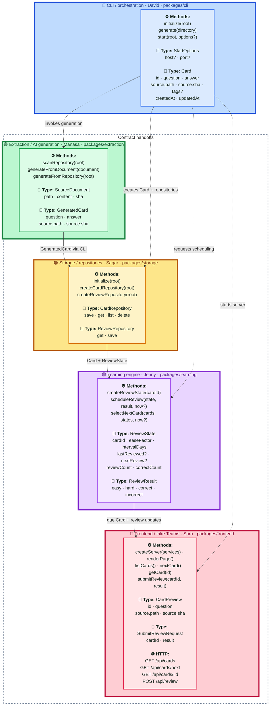

<p align="center">
  
</p>

<h1 align="center">FlashLearn</h1>

<p align="center"><strong>Agentic AI for compounding learning velocity.</strong></p>

<p align="center">Turn a Git repository into source-attributed study cards and a local spaced-repetition experience, powered by five independently owned packages connected through stable contracts.</p>

## Feature Map

This map tracks completion of the agreed owner workstreams, not whether prototype code exists. ✅ means the responsible owner has completed and merged the agreed package implementation. 🚧 means the workstream is still in progress. Package colors match the contract map: 🔵 CLI, 🟢 extraction, 🟠 storage, 🟣 learning, and 🔴 frontend. Starter code, mocks, and baseline implementations do not make a package complete.

1. 🔵 **CLI / orchestration** (`packages/cli`)
   - **Status:** ✅ Done
   - **Owner:** David
   - **Features:** `flashlearn init [directory]`, `flashlearn generate [directory]`, `flashlearn start [directory]`, configuration, directory selection, local server startup, orchestration, dependency injection, integration fakes, and pipeline tests
   - **Dependencies:** May depend on all packages
   - **Current:** Commands, package wiring, and integration tests are implemented
   - **Next:** Integrate completed owner packages as they merge

2. 🟢 **Extraction / AI generation** (`packages/extraction`)
   - **Status:** 🚧 In Progress
   - **Owner:** Manasa
   - **Features:** Repository ingestion and scanning, knowledge extraction, question and answer generation, and source attribution (`path`, `sha`)
   - **Dependencies:** Shared contracts only
   - **Current:** Starter repository scanning and annotation extraction provide a development baseline
   - **Next:** Complete repository ingestion and AI-backed question and answer generation

3. 🟠 **Storage / repositories** (`packages/storage`)
   - **Status:** 🚧 In Progress
   - **Owner:** Sagar
   - **Features:** Card persistence, retrieval APIs, local JSON storage format, and repository abstractions
   - **Dependencies:** Shared contracts only
   - **Current:** Starter JSON repositories demonstrate the locked persistence interfaces
   - **Next:** Complete and validate the storage package implementation

4. 🟣 **Learning engine** (`packages/learning`)
   - **Status:** 🚧 In Progress
   - **Owner:** Jenny
   - **Features:** Review scheduling, spaced-repetition logic, due-card selection, and easy/hard/correct/incorrect scoring
   - **Dependencies:** Shared contracts only
   - **Current:** A baseline scheduler demonstrates review-state updates and due-card selection
   - **Next:** Complete and validate the agreed spaced-repetition behavior

5. 🔴 **Frontend / fake Teams** (`packages/frontend`)
   - **Status:** 🚧 In Progress
   - **Owner:** Sara
   - **Features:** Card display, answer reveal, review actions, HTTP handlers, and the fake Teams browser experience
   - **Dependencies:** Shared contracts only
   - **Current:** Starter HTTP endpoints and a minimal reveal page demonstrate the integration boundary
   - **Next:** Complete the fake Teams experience, review controls, and frontend behavior

Shared infrastructure is ✅ **Done**: the data and HTTP contracts, workspace ownership rules, package-scope enforcement, CI, and local hooks are in place.

David's directory responsibility is selecting the input directory and passing it into the pipeline. Manasa owns traversing and interpreting that repository inside the extraction package. David starts the local server through orchestration; Sara owns the server's HTTP handlers and UI behavior inside the frontend package.

Each contributor should change only their assigned `packages/<name>/` directory. Package tests and implementation stay together. Changes to `contracts/`, root configuration, or integration wiring require review from all affected owners.

## Workstream Interfaces

The end-to-end handoff is:

```text
David (CLI / orchestration)
  -> Manasa (question generation)
  -> Sagar (card storage)
  -> Jenny (learning engine)
  -> Sara (UI / fake Teams experience)
```

The flow describes data handoffs, not implementation imports. Only `packages/cli` composes concrete package implementations. Every other package works against types and interfaces in `contracts/`, allowing each owner to develop and test independently with mocks.

David is responsible for defining and coordinating agreement on these contracts before implementation changes cross package boundaries:

1. `Card` and `GeneratedCard`
2. `ReviewState` and review result values
3. `CardRepository` and `ReviewRepository`
4. CLI commands: `flashlearn init [directory]`, `flashlearn generate [directory]`, and `flashlearn start [directory] [--host <host>] [--port <port>]`
5. API endpoint names and HTTP payloads

The locked HTTP endpoints are:

```http
GET /api/cards
GET /api/cards/next
GET /api/cards/:id
POST /api/review
```

Once the team agrees on these contracts, contributors should build against package-local mocks and tests. The implementations can then merge through the CLI composition layer with minimal coordination overhead.

### Contract Map

Types are physically declared in `contracts/index.d.ts` when they cross package boundaries, but every type has one owning workstream. Its package area below owns the type's meaning and evolution; consumers use the shared declaration without taking ownership. Only the CLI connects concrete package implementations.

Map legend: ⚙️ method, 🧩 type, 🌐 HTTP endpoint.



Contract ownership is:

1. **CLI:** `Card`, `StartOptions`, and orchestration methods
2. **Extraction:** `SourceDocument`, `GeneratedCard`, and extraction methods
3. **Storage:** `CardRepository`, `ReviewRepository`, and storage lifecycle methods
4. **Learning:** `ReviewState`, `ReviewResult`, and scheduling methods
5. **Frontend:** `CardPreview`, `SubmitReviewRequest`, HTTP endpoints, and frontend service methods

## Locked Contract

`contracts/index.d.ts` locks `Card`, `GeneratedCard`, `ReviewState`, repository ports, and review results. `contracts/http.md` locks endpoint names and payloads. Storage is JSON with these files:

```text
.flashlearn/
  cards.json
  review.json
  settings.json
```

`npm run boundaries` rejects imports between implementation packages. Only the CLI can import package implementations. `CI / Only Edit One Package` rejects a pull request that edits more than one directory under `packages/`; shared root and contract changes do not count as an additional package. `CI / Validate` runs boundaries, typechecks, and tests. `CI / Build` builds the complete workspace and smoke-tests the compiled CLI. Configure the five placeholder teams in `.github/CODEOWNERS`, then enable required code-owner reviews and these CI checks in GitHub branch protection.

## Development

```bash
npm install
npm run check
npm run build
npm run test --workspace @flashlearn/learning
```

Run the development CLI from the repository root:

```bash
npm run dev --workspace @flashlearn/cli -- --help
npm run dev --workspace @flashlearn/cli -- init .
npm run dev --workspace @flashlearn/cli -- generate .
npm run dev --workspace @flashlearn/cli -- start . --host 127.0.0.1 --port 4173
```

The CLI returns exit code `0` for success, `1` for execution failures, and `2` for invalid commands or arguments. See `packages/cli/README.md` for its dependency-injection and integration-test structure.

Husky installs through the root `prepare` script. Pre-commit checks package boundaries and staged whitespace. Pre-push enforces one-package scope, runs all checks, and builds the complete workspace. CI remains authoritative because hooks can be bypassed with `--no-verify`.

The baseline extractor creates cards from adjacent annotations in supported source and Markdown files:

```ts
// Q: What starts the local application?
// A: The flashlearn start command.
```

The `QuestionExtractor` port is the seam for replacing this baseline with an LLM-backed implementation without changing storage or learning code.
